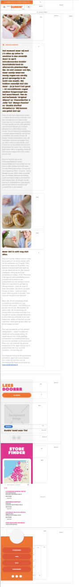
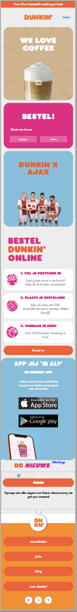

# Procesverslag
Markdown is een simpele manier om HTML te schrijven.  
Markdown cheat cheet: [Hulp bij het schrijven van Markdown](https://github.com/adam-p/markdown-here/wiki/Markdown-Cheatsheet).

Nb. De standaardstructuur en de spartaanse opmaak van de README.md zijn helemaal prima. Het gaat om de inhoud van je procesverslag. Besteedt de tijd voor pracht en praal aan je website.

Nb. Door *open* toe te voegen aan een *details* element kun je deze standaard open zetten. Fijn om dat steeds voor de relevante stuk(ken) te doen.

## Jij

  
uitwerken voor kick-off werkgroep

  ### Auteur:
  Niga Majid

  #### Je startniveau:
  Blauw (heel lichtblauw)

  #### Je focus:
  Ik ga mijn focus leggen op de website responsive maken

## Je website

  
uitwerken voor kick-off werkgroep

  ### Je opdracht:
https://www.dunkin.nl

  #### Screenshot(s) van de eerste pagina (small screen):
  hier de naam van de pagina  
  

  #### Screenshot(s) van de tweede pagina (small screen):
  hier de naam van de pagina  
  

## Toegankelijkheidstest 1/2 (week 1)

  
We gingen in groepjes toegankelijkheidstesten doen met onze eigen website. Hierdoor hebben we een paar bevindingen waar we aan kunnen werken

  ### Bevindingen
De tab werkt soms niet goed op elke button etc. Dus bijvoorbeeld voor het logoo kan ik er een button van maken.
Bij de blurred vision zie je de grote kopjes wel en de kleine tekst bijna niet

  #### Screenreader
Dit ging wel goed

  #### Motoriek (shocks, elastiekjes)
  Met de shocks ging het best prima om door de website te klikken, de knoppen kan misschien wel groter dan is het makkelijk om op knoppen te klikken.
Met de  elastiekjes was het moeilijk om in te zoomen, weet niet zo goed hoe je inzoomen kan verbeteren op een website.

  #### Visueel (brillen, contrast, kleurenblind, dark/light).
  Hier korte omschrijving (met indien nodig afbeeldingen)
  Met de gele bril zie ik niet heel veel verandering. Ik heb niet veel kleuren geel in de website dus dat maakt het niet een groot probleem.

  De bril met een klein rondje waar je in kunt zien zie je eigenlijk alleen informatie in jet midden dus knoppen bijvoorbeeld kun je in het midden zetten of belangrijke informatie kun je ook in het midden zetten.

Dunkin donuts heeft geen dark mode. De mensen met kleurenblind zien andere kleuren dan roze en oranje maar meer groen en geel. Er is ook een soort waar ze alleen maar roze rood en blauw zien. Dus dat is goed geregeld.

## Breakdownschets (week 1)

  
uitwerken na afloop 2e werkgroep

  ### de hele pagina:
  

  

  Hierdoor is mijn html pagina wel goed ingedeeld. :)

## Voortgang 1 (week 2)

  
uitwerken voor 1e voortgang

  ### Stand van zaken
Ik vond de breakdown schets maken toch moeilijker dan verwacht. Ik heb veel dingen verbeterd na het opnieuw bekijken met mijn docent. Hierdoor ben ik langer bezig geweest en had ik minder tijd voor de html waardoor ik nog maar best weinig html heb maar dat ga ik inhalen.

  ### Agenda voor meeting
  samen met je groepje opstellen
Mijn groepje bestaat uit Ralph, Kim, Thomas en ik. We hebben afgesproken om een groot stuk HTML te hebben en sowieso een header.

  ### Verslag van meeting
  hier na afloop snel de uitkomsten van de meeting vastleggen
Nog een paar punten van de breakdown schets besproken, en wat kleine dingen moet ik nog veranderen. Vooral sections met UL en LI's. Verder moet ik gewoon beginnen met het typen van mijn HTML. Anders ga ik achter lopen.

## Voortgang 2 (week 3)

  
uitwerken voor 2e voortgang

  ### Stand van zaken
Ik heb mijn HTML afgerond van pagina 1. Alles staat er nu in, ik hoop op de goede manier.. :P. Ik vind het heel lastig om met CSS te beginnen. Vooral omdat je vaak moet gaan kijken naar parents en children en dat snap ik gewoon nog niet zo goed. Ben vooral aan het gokken, dus ik weet dat als ik begin met CSS dat er veel fout gaat en ben het eigenlijk een beetje aan het ontlopen. Maar ik moet wel gaan beginnen. Na de les van Javascript heb ik gezien hoe je een hamburger menu maakt. Best lastig maar ergens ook wel te doen. Alleen weer moeilijk als ik moet kijken naar welk onderdeel uit de html je moet gebruiken en ook weer met parents en children etc. Dat is het grootste obstakel waar ik tegen aan loop.

  ### Agenda voor meeting
  samen met je groepje opstellen
We hebben afgesproken om een deel CSS te maken + een hamburger menu of in ieder geval een start te maken met het hamburger menu want dat kan nog wel lastig zijn. Ik wil tijdens de meeting mijn html laten controleren zodat ik goed begin met de CSS. Verder wil ik een klein stukje CSS laten controleren en kijken hoever ik kom met de hamburger menu.

  ### Verslag van meeting
  Ik ben goed op weg met HTML, nog een paar kleine veranderingen maar ik kan nu goed een begin maken aan het CSS gedeelte waar ik nog wel veel moeite mee heb.

## Toegankelijkheidstest 2/2 (week 4)

  
uitwerken na test in 8e werkgroep

  #### Screenreader
  De screenreader gaat er goed door heen. De pagina is nog niet helemaal af maar ben al heel ver!

Ik heb ook geleerd hoe ik de screenreader aanzet en hoe ik naar knoppen en links kan navigeren op mijn website.

  #### Muis en Toetsenbord
  Hier korte omschrijving (met indien nodig afbeeldingen)

  Hier een omschrijving van hoe het opgelost kan worden (met indien nodig afbeeldingen)

  #### Motoriek (shocks, elastiekjes)
Ik heb de knoppen voor als iemand schocks heeft best groot gemaakt dus hiermee heb ik dat opgelost.

  #### Visueel (brillen, contrast, kleurenblind, dark/light).
  Ik heb weinig geel in mijn website dus daarmee heb ik vrijwel niks gedaan. Ik heb voor kleurenblind verschillende kleuren gebruikt voor de hover focus en active state. Dus niet alleen maar van kleur verwisselen maar ook roze bijvoorbeeld gebruikt.

## Voortgang 3 (week 4)

  
uitwerken voor 3e voortgang

  ### Stand van zaken
Ik heb met Sanne gezeten en dat ging best goed. ik ben veel verder gekomen, en ik snap MEER hoe grid in elkaar zit en het is voor mezelf handig om het uit te tekenen. Ik ben een heel eind gekomen maar er moet ook  nog wel veel gebeuren.

  ### Agenda voor meeting
  samen met je groepje opstellen

  | Kim     | Thomas         | Niga   | Alexander       |
  | ---            | ---                | ---          | ---              |
  | ontwerp menu | javascript, content toevoegen menu          | Menu uitklappen   | en dan ik dat    |
  | tekst en afbeelding | artikelen filteren | er gebeurt niks in met css | Javascript zeker |
  | ...            | ...                | ...          | ...              |

  ### Verslag van meeting
  hier na afloop snel de uitkomsten van de meeting vastleggen

Ik moet er vooral op letten dat ik alles goed in github zet omdat ik dat nog niet had gedaan kon er niet goed gekeken worden naar mijn website zoals de fonts die misten. Mijn html ziet er wel goed uit verder en ik ben al wel een heel eind. Ik moet vooral nog veel kijken naar hoe ik het overzet naar een groot scherm.

## Eindgesprek (week 5)

  
uitwerken voor eindgesprek

  ### Je uitkomst - karakteristiek screenshots:
  

  ### Dit ging goed/Heb ik geleerd:
Ik heb echt heel erg veel geleerd. IK kan eindelijk zeggen dat ik er nu veel meer van snap dan ooit. Ik ben vooral blij dat ik met Sanne nog even heb gezeten waardoor ik vooral de media queries beter begrijp en Css grid.

  ### Dit was lastig/Is niet gelukt:
Ik vind alles eigenlijk nog steeds lastig. Ik begrijp het meestal wel maar als ik het eenmaal zelf moet gaan doen gaat er toch nog veel mis. Gelukkig heb ik wel de mogelijkheid om veel te vragen en bij elke les aanwezig te zijn. Ik ben ook heel blij dat ik dit heb gedaan. Wat ik nog steeds het lastigst vind is om het verschil te zien tussen wat de parent is en wat de childrens. Ik merk dat ik in CSS vaak nog de verkeerde aanroep en het dan niet werkt.

  

## Bronnenlijst

  
continu bijhouden terwijl je werkt

  Ik heb voor de foto's alles overgenomen van de originele website. Mijn grootste bron was Sanne :D. Verder heb ik niet heel veel bronnen gebruikt.

  1. https://global-uploads.webflow.com/612741c59719f34382ce4741/612a8702a08f341918cab4b8_vegan%201.jpg
  2. https://global-uploads.webflow.com/612741c59719f395d4ce4719/612741c59719f3752cce4769_Primary_Logo%C2%AE_HEX.svg

  3. https://global-uploads.webflow.com/612741c59719f395d4ce4719/612741c59719f30836ce4753_Webclip%20%5B256x256%5D.svg

  4. https://global-uploads.webflow.com/612741c59719f395d4ce4719/6127a21316434169d1591df7_Ajax-x-Dunkin_web2.png

  5. w3schools.nl

